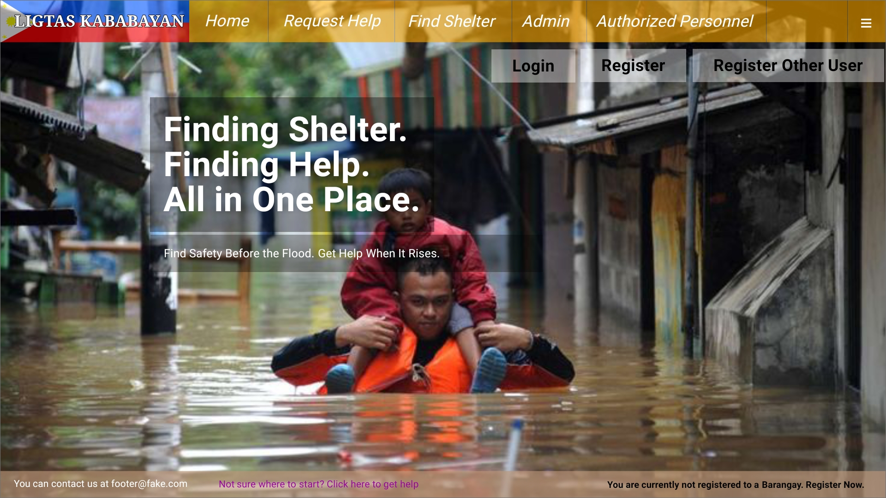
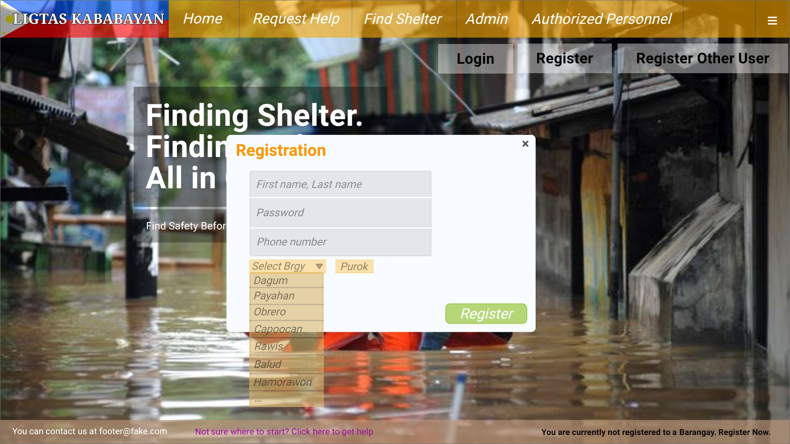

# LigtasKababayan_App

## About
- LigtasKababayan is a localized, responsive web system 
designed to improve communication between citizens and 
local emergency responders before and during severe 
flooding events. The system focuses on evacuation-center 
information, emergency reporting, and rescue 
prioritization at the barangay level. LigtasKababayan 
aims to help reduce rescue response time and lessen the 
risk associated with misinformation and delayed 
emergency reporting.

## Features
- Evacuation-center capacity monitoring 
- Find Shelterc information for citizens 
- Emergency help request 
- Water-level classification 
- Vulnerable-person identification 
- Separate Vulnerable and Normal rescue queues 
- GPS-based current-location reporting for responders 
- Location descriptions 
- Optional location photographs 
- Head count information 
- Phone-number information 
- Admin management of active rescue reports 
- Rescue-status updates through the RESCUED function 
- User login and account authentication 
- Barangay registration, where the user creates/registers 
an account with their current barangay and purok 
- Re-Registration, which allows the user to update their 
registered barangay and purok when they move or are 
temporarily staying in another barangay. 
- Register Other User, which allows a user to create 
an account for another person who is temporarily 
unable to register themselves

## Limitations
- Requires an available internet connection to transmit information.
- Evacuation-center capacity depends on authorized personnel keeping the 
information updated. 
- The system provides information and prioritizes reports 
but does not physically perform rescue operations.
- GPS/location information may not always be sufficient, so descriptions and photos are supplementary.
- The current system is focused on flooding, rather than all disaster types.

# Mockups

## Home page

## Register Page

## Login Page

## Request Help Page

## Find Shelter Page

## Admin page

## Authorized Personnel Page

